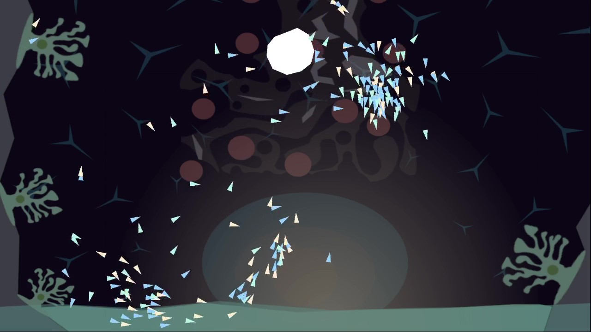

# BoidsFlockingGodot
Simple boids flocking implementation in Godot Engine.

Movie: https://youtu.be/IMv7iNt1baE  
Blog(日本語): https://www.bioerrorlog.work/entry/boids-flocking-godot

## Reference
https://github.com/codatproduction/Boids-simulation  
https://github.com/alifelab/alife_book_src